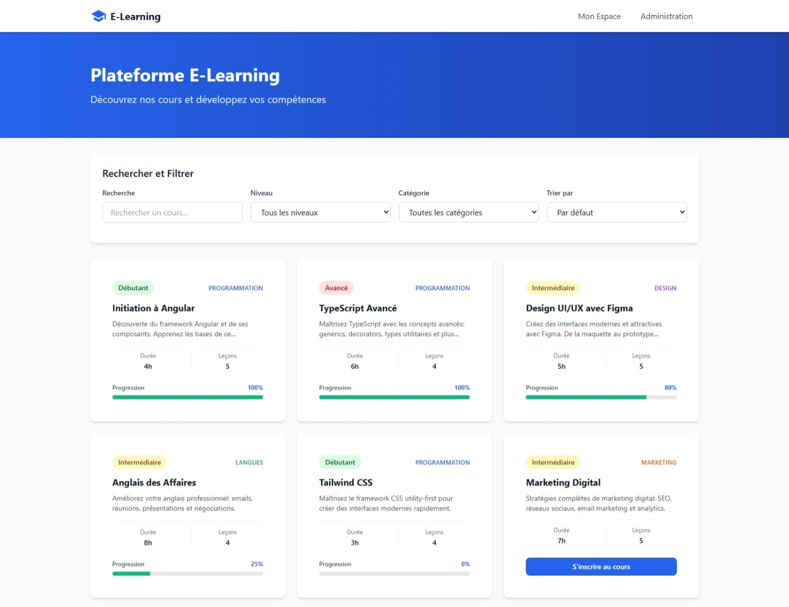
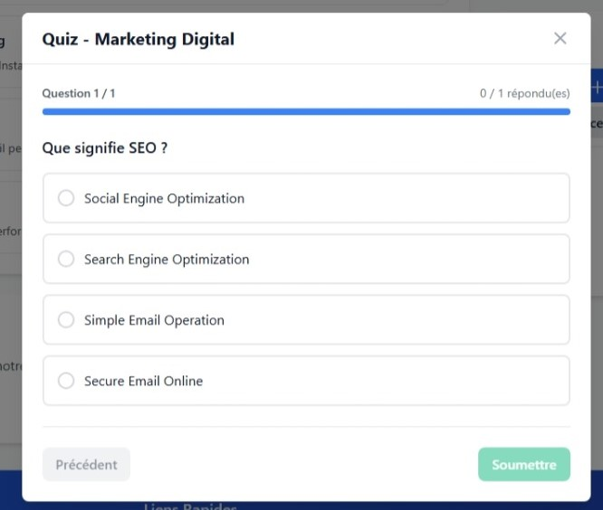
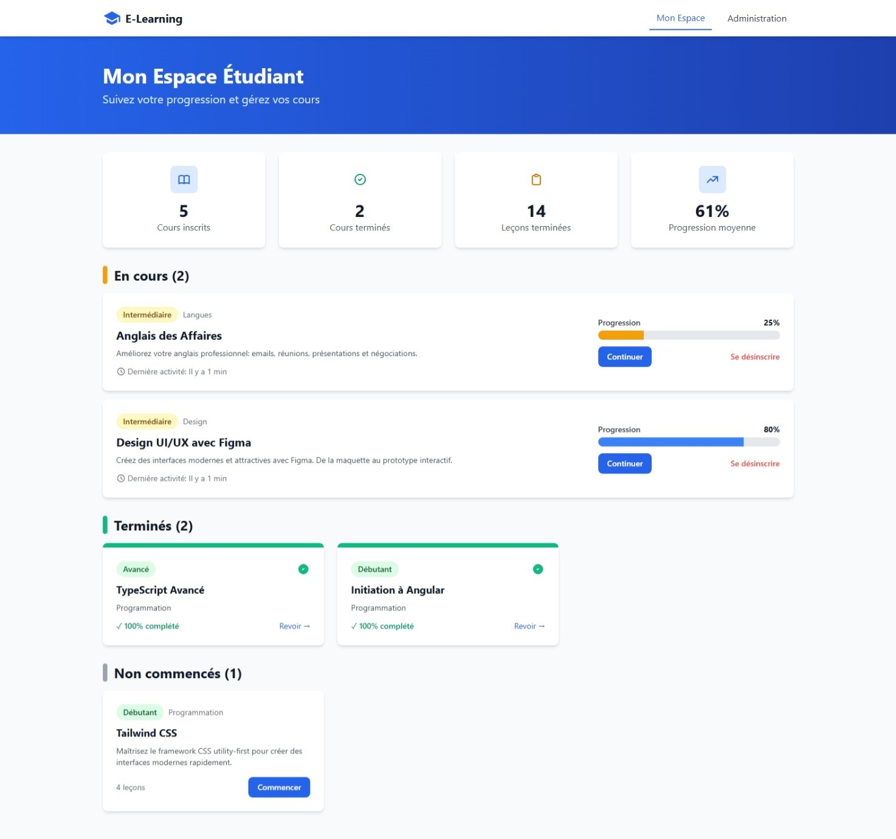
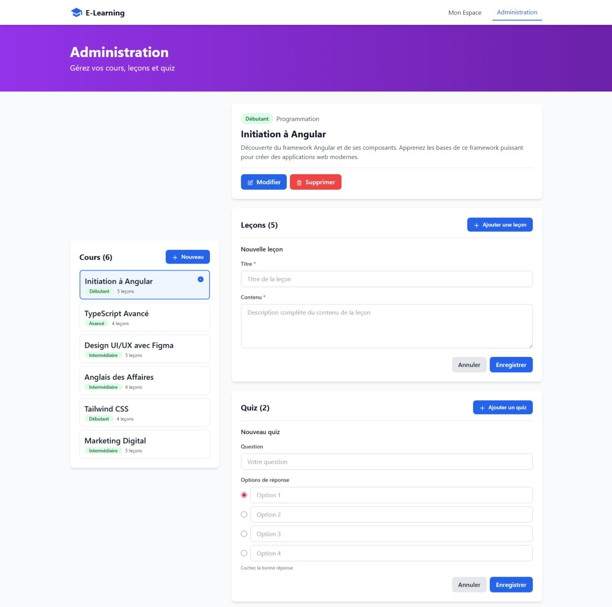
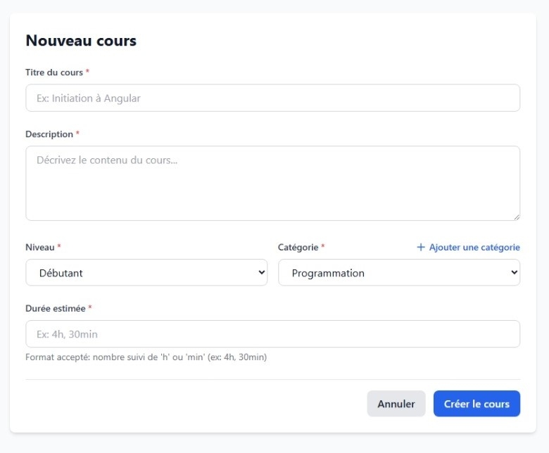

# 📚 Plateforme E-Learning

> Mini plateforme de formation en ligne destinée à un usage interne

[🔗 Voir la démo en ligne](https://suufiaane13.github.io/elearning/)

## Description

Application web de formation en ligne permettant aux formateurs de publier des cours et aux étudiants de consulter ces cours, suivre leur progression et marquer les leçons terminées.

**Caractéristiques principales :**
- Application front-end uniquement (Angular 18)
- Données gérées localement (localStorage)
- Interface moderne et responsive (Tailwind CSS)

---

## Fonctionnalités

### 🏠 Page d'Accueil
- Liste de tous les cours disponibles
- Filtrage par niveau (Débutant, Intermédiaire, Avancé)
- Filtrage par catégorie (Programmation, Design, Langues, Marketing)
- Recherche textuelle en temps réel
- Tri par durée
- Inscription rapide aux cours

### 📖 Détail du Cours
- Informations complètes du cours
- Liste des leçons avec checkbox de complétion
- Barre de progression visuelle
- Système de quiz interactif
- Calcul automatique du pourcentage de progression

### 📝 Quiz Interactif
- Questions à choix multiples
- Navigation entre les questions
- Score avec feedback visuel
- Validation avant soumission

### 👨‍🎓 Espace Étudiant
- Tableau de bord avec statistiques :
  - Cours inscrits
  - Cours terminés
  - Leçons complétées
  - Progression moyenne
- Classification des cours (En cours, Terminés, Non commencés)
- Gestion des inscriptions

### 🔧 Administration
- **CRUD Cours** : Création, modification, suppression
- **CRUD Leçons** : Ajout, modification, suppression
- **CRUD Quiz** : Ajout et suppression
- **Gestion des catégories** : Ajout de nouvelles catégories
- Validation complète des formulaires

#### Formulaire de Création de Cours

---

## 🛠️ Technologies

- **Framework** : Angular 18.2.19
- **Langage** : TypeScript 5.5
- **Styling** : Tailwind CSS 3.4
- **Persistance** : localStorage
- **Qualité** : ESLint

---

## 📊 Données

### Cours Mock Inclus

6 cours prêts à l'emploi :
1. **Initiation à Angular** - Débutant (4h, 5 leçons)
2. **TypeScript Avancé** - Avancé (6h, 4 leçons)
3. **Design UI/UX avec Figma** - Intermédiaire (5h, 5 leçons)
4. **Anglais des Affaires** - Intermédiaire (8h, 4 leçons)
5. **Tailwind CSS** - Débutant (3h, 4 leçons)
6. **Marketing Digital** - Intermédiaire (7h, 5 leçons)

### Persistance

Toutes les données sont stockées dans le localStorage :
- `courses` : Liste des cours
- `student_progress` : Progression de l'étudiant
- `course_categories` : Catégories personnalisées

---

## 🎓 Contexte Académique

**Durée** : 4 semaines  
**Équipe** : 5 personnes  
**Technologies** : Angular + Tailwind CSS  
**Type** : Projet front-end uniquement (sans backend)
